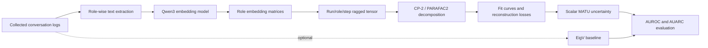

# MATU Architecture

MATU measures uncertainty from the full trajectory of a multi-agent run rather
than only the final answer.

## Modules

- `matu.embed_logs`: converts conversation logs into role-specific embedding
  matrices.
- `matu.cp2_matu`: runs the CP-2 style decomposition and stores fit curves,
  reconstruction losses, and scalar MATU uncertainty.
- `matu.fit_to_uncertainty`: converts legacy `fit_dict` files into scalar
  uncertainty scores.
- `matu.evaluate_uncertainty`: computes AUROC and AUARC from uncertainty scores
  and repeated-run correctness labels.
- `baselines.eigv`: computes an NLI graph/eigenvalue uncertainty baseline.
- `matu.cli`: exposes the same operations through the `matu` command.

## Runtime Notes

Embedding is usually the most memory-sensitive stage because it loads the
sentence embedding model. CP-2 runtime scales with the number of tasks, runs,
trajectory length, embedding dimension, rank range, and ALS iterations. For a
small smoke test, reduce `max_rank` and `max_iter` in a config file.
